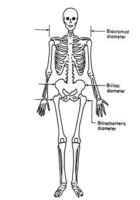

```{r setup, include=FALSE}
knitr::opts_chunk$set(echo = TRUE, message = FALSE, warning = FALSE,
                      fig.width = 7, fig.height = 4.5, fig.align = "center")
```

# Learning objectives

By the end of this practical you should be able to:

1.  Inspect a dataset's structure and distinguish types of variables
2.  Compute summary statistics (mean, median, SD, coefficient of
    variation) overall and by group
3.  Use histograms to recognise symmetric, left- and right-skewed
    distributions and apply data transformations to change them
4.  Compare groups visually using boxplots
5.  Identify and deal with missing values and outliers
6.  Apply standardisation to compare variables measured on different
    scales
7.  Interpret parallel-coordinates plots to compare multivariate
    profiles across individuals and groups

# Instructions

> **How to use this notebook.** Read each short explanation, then press
> the green *play* button (▶) at the top-right of each grey *code chunk*
> to run it. Look at the output, and answer the **Questions**. Write
> your answers in plain text under each one. The goal is to *understand
> the concepts and patterns in the data*, not to memorise code.
>
> This practical has **two case studies**; one on body measurements
> (Case Study 1) and another one on blood laboratory analysis (Case
> Study 2). Initial questions in Case Study 1 do not require coding;
> just examining the code and the output; the final **advanced
> questions** of Case Study 1, as well as questions in Case Study 2 are
> not necessarily found in the notebook outputs and might require
> adapting some code lines, putting to work your acquired R programming
> skills!

------------------------------------------------------------------------

# Case Study 1 — Body dimensions of healthy adults

We start with an easy, intuitive dataset: **body measurements of 507
physically active adults** (247 men and 260 women), from the
[openintro](https://www.openintro.org/data/index.php?data=bdims) package
(Source: Heinz G, Peterson LJ, Johnson RW, Kerk CJ. 2003.).

The 21 body measurements come in two families (all in **cm**):

| Family | Examples (column codes) | Meaning |
|----|----|----|
| **Skeletal diameters** | `bia_di`, `bii_di`, `bit_di`, `che_di`, `elb_di`, `wri_di`, `kne_di`, `ank_di` | bone-to-bone breadths (biacromial/shoulder, biiliac/pelvis, bitrochanteric/hip, chest, elbow, wrist, knee, ankle) |
| **Girths (circumferences)** | `sho_gi`, `che_gi`, `wai_gi`, `hip_gi`, `thi_gi`, `bic_gi`, `for_gi`, `cal_gi` | shoulder, chest, waist, hip, thigh, biceps, forearm, calf |

Plus `age` (years), `wgt` (weight, kg), `hgt` (height, cm) and `sex` (1
= male, 0 = female).



**Figure.** Biacromial, Biiliac, and Bitrochanteric Diameters.

## Load the data

```{r load-bdims}
bd <- read.csv("../data/bdims.csv")
bd$sex <- factor(bd$sex, levels = c(0, 1), labels = c("female", "male"))
head(bd)
```

> **Question 2.1.** In which file format was the dataset stored on disk,
> and which data structure was it converted to?

### Looking at the raw file before trusting it

Before any analysis, a good data scientist *looks at the raw file* to
see how it is written. The chunk below prints the first three lines
exactly as stored on disk.

```{r bdims-raw-lines}
readLines("../data/bdims.csv", n = 3)
```

> **Question 2.2.** From those raw lines, work out: (a) what character
> **separates the columns** (a comma? a semicolon? a tab?); and (b) what
> character is the **decimal point** (a dot or a comma?); Why does R
> need to know the separator and the decimal mark to read the file
> correctly? (This is why we used `read.csv`, which assumes a comma
> separator and a dot decimal.)

## Looking at the dataset structure

```{r bdims-structure}
dim(bd)          # rows (people) and columns (measurements)
str(bd)
```

> **Question 2.3.** How many people are in the dataset, and how many
> measurements were taken on each one? Which single variable is
> *categorical* (referred to in R as a *Factor*) rather than a number?

## Calculating summary statistics

```{r}
mean(bd$age)
median(bd$age)
min(bd$age)
max(bd$age)
quantile(bd$age,c(0,0.5,0.99,1))
```

> **Question 2.4.** What are the mean, median, min, max, and 99th
> percentile of `age` in the studied population?

```{r}
sd(bd$wai_gi)
sd(bd$hgt)
```

> **Question 2.5.** What are the standard deviations of waist girth
> (`wai_gi`) and height (`hgt`)?

```{r}
sd(bd$wai_gi)/mean(bd$wai_gi)*100
sd(bd$hgt)/mean(bd$hgt)*100
```

> **Question 2.6.** What are their coefficients of variation (standard
> deviation divided by mean)?

> **Question 2.7.** Which of the two variables has higher *intrinsic
> variability* (i.e., which trait is proportionally more variable across
> people)? Can you think of a cause for the increased variability in
> this body dimension?

## Visualizing distributions with histograms

```{r bdims-hist, fig.width=9}
par(mfrow = c(1, 2)) # display output in two columns
hist(bd$hgt, breaks = 30, col = "steelblue",  main = "Height", xlab = "height (cm)")
hist(bd$wai_gi, breaks = 30, col = "darkorange", main = "waist girth", xlab = "waist girth (cm)")
par(mfrow = c(1, 1))
```

> **Question 2.8.** Are height and wai_gi roughly *symmetric*
> (bell-shaped), or is there a longer tail to the right (right-skewed)
> or the left (left-skewed)?

In right-skewed distributions, the mean is commonly higher than the
median, while the opposite is true in left-skewed distributions.

```{r}
mean(bd$hgt)
median(bd$hgt)
mean(bd$wai_gi)
median(bd$wai_gi)
```

> **Question 2.9.** Based on the means and medians above, what is the
> case for height and waist girth?

```{r}
summary(bd)
```

> **Question 2.10.** Which diameters/bone-to-bone measurements are the
> largest and the shortest, on average?

## Examining categorical variables

```{r}
table(bd$sex)    # how many women and men
prop.table(table(bd$sex))
```

> **Question 2.11.** What is the proportion of females and males in the
> dataset?

## Comparing groups

Calculating the mean per group with manual subsetting

```{r}
mean(bd$sho_gi)
mean(bd$sho_gi[bd$sex=="male"])
mean(bd$sho_gi[bd$sex=="female"])
```

and with automatic subsetting for all factor levels

```{r}
tapply(bd$sho_gi, bd$sex, mean)
```

> **Question 2.12.** What is the mean shoulder girth in males and
> females?

Now we calculate standard deviations

```{r}
sd(bd$sho_gi)
sd(bd$sho_gi[bd$sex=="male"])
sd(bd$sho_gi[bd$sex=="female"])
```

> **Question 2.13.** How does the standard deviation (SD) change in the
> complete population compared to females or males only?

Now we'll define a function to calculate the coefficient of variation
(CV) for any numeric vector

```{r}
cv <- function(x, na.rm = TRUE) {
  sd(x, na.rm = na.rm) / mean(x, na.rm = na.rm) * 100
}
```

```{r}
cv(bd$sho_gi)
cv(bd$sho_gi[bd$sex=="male"])
cv(bd$sho_gi[bd$sex=="female"])
```

> **Question 2.14.** Are inter-sex differences in SD large or small
> compared to those in CV? Explain the differences between SD and CV.

## Visually comparing groups using boxplots

> **Question 2.15.** Interpret all the elements shown in the boxplots
> below.

```{r}
boxplot(bd$sho_gi, main="Shoulder girth", ylab="cm")
boxplot(bd$hip_gi, main="Hip girth", ylab="cm")
```

now split by sex

```{r bdims-sex, fig.width=9}
par(mfrow = c(1, 2))
boxplot(sho_gi ~ sex, data = bd, col = c("plum","steelblue"),
        main = "Shoulder girth", xlab = "", ylab = "cm")
boxplot(hip_gi ~ sex, data = bd, col = c("plum","steelblue"),
        main = "Hip girth", xlab = "", ylab = "cm")
par(mfrow = c(1, 1))
```

> **Question 2.16.** Which measurement separates males and females more
> clearly — shoulder girth or hip girth?

Now stratify by age, using 40 years as a cutoff

```{r}
hist(bd$age)
age_above_40_vector <- bd$age > 40
bd$age_above_40 <- factor(age_above_40_vector, levels=c(FALSE,TRUE),labels=c("below40y","above40y"))
```

```{r}
table(bd$age_above_40)
```

> **Question 2.17.** How many individuals are above or below 40 years
> old?

Now we look at boxplots for each age group separately

```{r}
par(mfrow = c(1, 2))
boxplot(sho_gi ~ age_above_40, data = bd, col = c("plum","steelblue"),
        main = "Shoulder girth", xlab = "", ylab = "cm")
boxplot(wai_gi ~ age_above_40, data = bd, col = c("plum","steelblue"),
        main = "Waist girth", xlab = "", ylab = "cm")
par(mfrow = c(1, 1))
```

> **Question 2.18.** Which measurement separates younger and older
> individuals more clearly — shoulder or waist girth?

Now we visualize the distributions split by both sex and age groups:

```{r bdims-sex-age, fig.width=9}
boxplot(sho_gi ~ sex + age_above_40, data = bd, col = c("plum","steelblue"),
        main = "Shoulder girth", xlab = "", ylab = "cm", las=2)
boxplot(wai_gi ~ age_above_40 + sex , data = bd, col = c("plum","steelblue"),
        main = "Waist girth", xlab = "", ylab = "cm", las=2)
```

> **Question 2.19.** In which sex group does the effect of age on waist
> girth seem stronger?

### Advanced questions (requires coding)

> **Question 2.20.** The following code generates boxplots for every
> body measurement. Is there any body measurement that is on average
> larger in females than in males? Report the mean and standard
> deviation for them.

```{r}
measurement_columns <- c("bia_di","bii_di","bit_di","che_di","elb_di","wri_di","kne_di","ank_di",
               "sho_gi","che_gi","wai_gi","hip_gi","thi_gi","bic_gi","for_gi","cal_gi")

for (m in measurement_columns) {
  boxplot(bd[[m]] ~ bd$sex, main = m)
}

```

> **Question 2.21.** Calculate histograms for age, split by sex. Do male
> and female individuals have a similar age distribution in the dataset?
> Can you think of variables other than sex that might partly explain
> the measured variables?

> **Question 2.22.** If you were designing a medical device to be
> located around the wrist of a person (drawn from the population
> studied), which is the shortest size range that would accommodate 99%
> of the population?

> **Question 2.23.** Calculate the body mass index (BMI). What is the
> average BMI? Generate a boxplot. How many
> individuals have a BMI above 30 kg/m\^2 (considered well above the
> healthy range)? Now calculate BMI separating by sex and age groups.
> Which groups seem to have a higher BMI in the population sampled?
> NOTE: BMI is calculated as weight divided by height squared - with
> weight measured in kilograms and height measured in meters.

------------------------------------------------------------------------

# Case Study 2 — Hepatitis C blood panel

Each row is one person who had a blood sample analysed. The data come
from the [UCI HCV
dataset](https://archive.ics.uci.edu/dataset/571/hcv+data): healthy
**blood donors** and patients with hepatitis C at increasing stages of
liver damage (**Hepatitis → Fibrosis → Cirrhosis**).

The numeric columns are routine **laboratory tests**:

| Code | Lab test | What it reflects |
|----|----|----|
| ALB | Albumin | A protein the liver makes (synthetic function) |
| ALP | Alkaline phosphatase | Bile ducts / liver |
| ALT | Alanine aminotransferase | Liver-cell damage |
| AST | Aspartate aminotransferase | Liver-cell damage |
| BIL | Bilirubin | Liver clearance (rises in jaundice) |
| CHE | Cholinesterase | Liver synthetic function |
| CHOL | Cholesterol | Liver / metabolism |
| CREA | Creatinine | Kidney function |
| GGT | Gamma-glutamyl transferase | Bile ducts / liver |
| PROT | Total protein | Overall protein level |

`Category` is the diagnosis and `Sex` is m/f.

> **A note on units.** The source dataset does not state the measurement
> units. Based on the value ranges and the original publication, they
> are assumed to be the conventional clinical units — enzymes (ALT, AST,
> ALP, GGT) in U/L, bilirubin and creatinine in µmol/L, albumin and
> total protein in g/L, cholinesterase in kU/L, and cholesterol in
> mmol/L. We show "U/L" on some plot axes on that assumption; treat it
> as inferred, not documented.

## Load the data

```{r load}
hcv <- read.csv("../data/hcvdat0.csv", row.names = 1)
head(hcv)
```

## Getting to know the data

```{r structure}
# How many rows (patients) and columns (variables)?
dim(hcv)

# What is the TYPE of each variable?
str(hcv)
```

> **Question 2.24.** How many patients are in the dataset, and how many
> variables were measured on each one? Which variables are numeric
> measurements and which are categorical labels?

```{r categories}
table(hcv$Category)   # patients per diagnosis
```

> **Question 2.25.** How many patients are healthy blood donors, and how
> many have some form of liver disease (Hepatitis, Fibrosis, Cirrhosis)?
> Is the dataset *balanced* between healthy and diseased people?

## Missing values

Real datasets almost always have gaps. In R a missing value is shown as
`NA`.

```{r}
summary(hcv)
```

> **Question 2.26.** Which lab tests have missing values, and how many?
> If you wanted to analyse all 10 lab tests together, what could you do
> about the patients with missing results?

Let's check which observations have missing values in the column `CHOL`:

```{r}
hcv[is.na(hcv$CHOL),]
```

Let's remove missing values (NA's) and calculate the mean:

```{r}
mean(hcv$CHOL, na.rm=TRUE)
```

> **Question 2.27.** What is the result if we do not set the `na.rm`
> parameter to `TRUE`?

## Distributions

Let's look at the histogram and boxplot of variable AST.

```{r hist-ast}
hist(hcv$AST, breaks = 40, col = "steelblue",
     main = "Distribution of AST", xlab = "AST (U/L)")
```

```{r box-ast}
boxplot(hcv$AST,col = "steelblue",
        main = "Boxplot of AST", xlab = "AST (U/L)")
```

> **Question 2.28.** Describe the shape of the AST distribution. Is it
> symmetric (bell-shaped), or does it have a long tail on one side? Now
> make a histogram for `CHE` (change `hcv$AST` to `hcv$CHE`). How is its
> shape different?

Sometimes it is useful to transform variables to reduce their skewness
(i.e., make them more symmetric) and reduce the influence of extreme
values. One of the most widely used transformations is the logarithmic
(log) transformation, which compresses large values more than small
ones.

```{r hist-ast-log}
hist(log(hcv$AST), breaks = 40, col = "steelblue",
     main = "Histogram of log of AST", xlab = "log(AST)")

boxplot(log(hcv$AST), col = "steelblue",
     main = "Boxplot of log of AST", ylab = "log(AST)")
```

> **Question 2.29.** Compare the shapes with and without log
> normalisation using histograms and boxplots.


## Spotting unusual values (outliers)

Examine the boxplots of the laboratory measurements

```{r}
labs <- c("ALB","ALP","ALT","AST","BIL","CHE","CHOL","CREA","GGT","PROT")
boxplot(hcv[,labs],las=2)
```

> **Question 2.30.** Which variables have values that are much larger
> than the rest? You can also explore the `summary()` output. Are these
> likely to be *mistakes* (typos, machine errors) or *real* extreme
> results from very sick patients? How would you decide? (Hint: the
> following function will retrieve the observation with the maximum
> value in a given variable, here CREA)

```{r}
hcv[which.max(hcv$CREA),]
```

Let's focus on CREA:

```{r}
boxplot(hcv$CREA)
```

The following function returns the values of the `outliers` in the CREA variable, as defined by the boxplot (and the boxplot.stats) function. That is, points sitting more than 1.5 times the interquartile range (IQR = Q3 − Q1, the width of the middle 50% of the data) beyond the edges of that middle-50% range

```{r}
boxplot.stats(hcv$CREA)$out
```

> **Question 2.31.** How many outliers are there according to the
> boxplot definition of outlier?

```{r}
boxplot.stats(log(hcv$CREA))$out
```

We can now see which observations those values correspond to:

```{r}
out_vals <- boxplot.stats(hcv$CREA)$out
hcv[hcv$CREA %in% out_vals, ]
```

> **Question 2.32.** Is there an enrichment in particular diagnosis
> groups among outliers compared to the complete dataset? In other
> words, is there a diagnosis group over-represented among outliers?

## Standardization

> **Question 2.33.** Study again the previous graph with boxplots. Would
> you say that the different measurements are in the same scale or that
> they rather vary across different value ranges? For instance, compare
> CHE to ALP in the plot below. How do they differ in terms of mean and
> standard deviation? Is that a problem for visualizing them together in
> the same scale?

```{r}
boxplot(hcv[,c("ALP","CHE")])
```

> **Question 2.34.** Compare the previous boxplot with the following
> one. How did we bring them to the same scale?

```{r}
alp_standardized <- (hcv$ALP - mean(hcv$ALP, na.rm = TRUE)) / sd(hcv$ALP, na.rm = TRUE)
che_standardized <- (hcv$CHE - mean(hcv$CHE, na.rm = TRUE)) / sd(hcv$CHE, na.rm = TRUE)

boxplot(data.frame(ALP = alp_standardized, CHE = che_standardized))
```

By scaling the data so that both measurements are expressed in the same
units or range, making it easier to compare their distributions
visually. This can be achieved by `standardizing` or normalizing the
data, such as using `z-scores` or min-max scaling.

> **Question 2.35.** What are the means and standard deviations of
> alp_standardized and che_standardized?

## Comparing disease groups

```{r box-by-group, fig.width=9}
boxplot(AST ~ Category, data = hcv, col = "lightblue",
        main = "AST by diagnosis", xlab = "", ylab = "AST (U/L)")
```

> **Question 2.36.** How does AST (a marker of liver-cell damage) change
> with disease severity?

Now let's explore all measurements

```{r all-boxes, fig.width=10, fig.height=8}
par(mfrow = c(3, 4), mar = c(3, 3, 2, 1))
for (v in labs) {
  boxplot(hcv[[v]] ~ hcv$Category, main = v, xlab = "", ylab = "",
          col = "lightblue", cex.axis = 0.7)
}
par(mfrow = c(1, 1))
```

> **Question 2.37.** Are there markers that tend to be lower in
> cirrhosis patients compared to control? Does that make biological
> sense? Which tests separate the disease groups most clearly, and which
> hardly differ between groups? How would you tell if the differences
> are statistically significant?

## BONUS Exercise: Visualizing all variables at once

We will generate a `parallel coordinates plot`, where each observation
is represented by a line that connects values across variables. In this
example we do it using the function `parallelplot` from the R package
`lattice`.

```{r profile-means, fig.width=8.5, fig.height=5}
# Load the package `lattice` which contains the desired function
library(lattice)
hcv_clean <- na.omit(hcv)
parallelplot(hcv_clean[, labs], horizontal.axis = FALSE, scales = list(x = list(rot = 90)))
```

> **Question 2.38.** Interpret the parallel profiles plot. Why do the
> lines in some columns look all compressed in the bottom while others
> look more dispersed? what is the `na.omit` function doing, and what
> happens if we don't use it?

> **Question 2.39.** `CREA` is one of the most "compressed" variables.
> what happens in the following plot, after log-transforming it?

```{r}
hcv_clean_log <- hcv_clean
hcv_clean_log$CREA <- log(hcv_clean_log$CREA)
parallelplot(hcv_clean_log[, labs], horizontal.axis = FALSE, scales = list(x = list(rot = 90)))

```

Now we will split the parallel plot by diagnosis group.

```{r}
parallelplot(~hcv_clean_log[, labs] | hcv_clean_log$Category, horizontal.axis = FALSE, scales = list(x = list(rot = 90)))
```

> **Question 2.40.** Can you identify different patterns associated to
> each profile? How do they compare to random groups of individuals?
> (shown in the following plot)

```{r}
parallelplot(~hcv_clean_log[, labs] | sample(hcv_clean_log$Category), horizontal.axis = FALSE, scales = list(x = list(rot = 90)))
```

Next we will plot the average for each diagnosis group instead of all
individual measurements

```{r}
#Average each test within each diagnosis group, and look at the table
mean_profiles <- aggregate(hcv_clean_log[,labs], by = list(Group = hcv_clean_log$Category), FUN = mean, na.rm = TRUE)
mean_profiles
parallelplot(mean_profiles[,labs], group=mean_profiles$Group, horizontal.axis = FALSE, scales = list(x = list(rot = 90)), auto.key = list(space = "top"))

```

> **Question 2.41.** Reading the profile plot, which lab tests pull the
> **cirrhosis** line far away from the **donor** line (the most
> *discriminating* tests)?

------------------------------------------------------------------------

```{r session}
sessionInfo()
```
